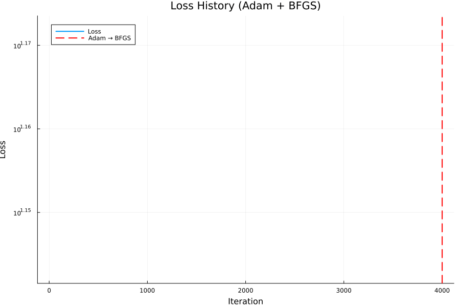
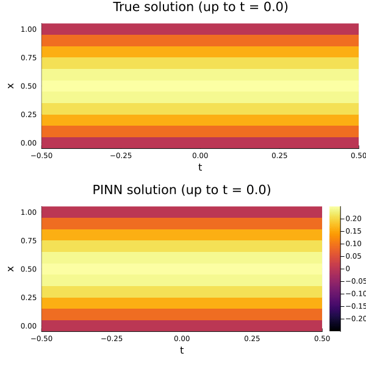
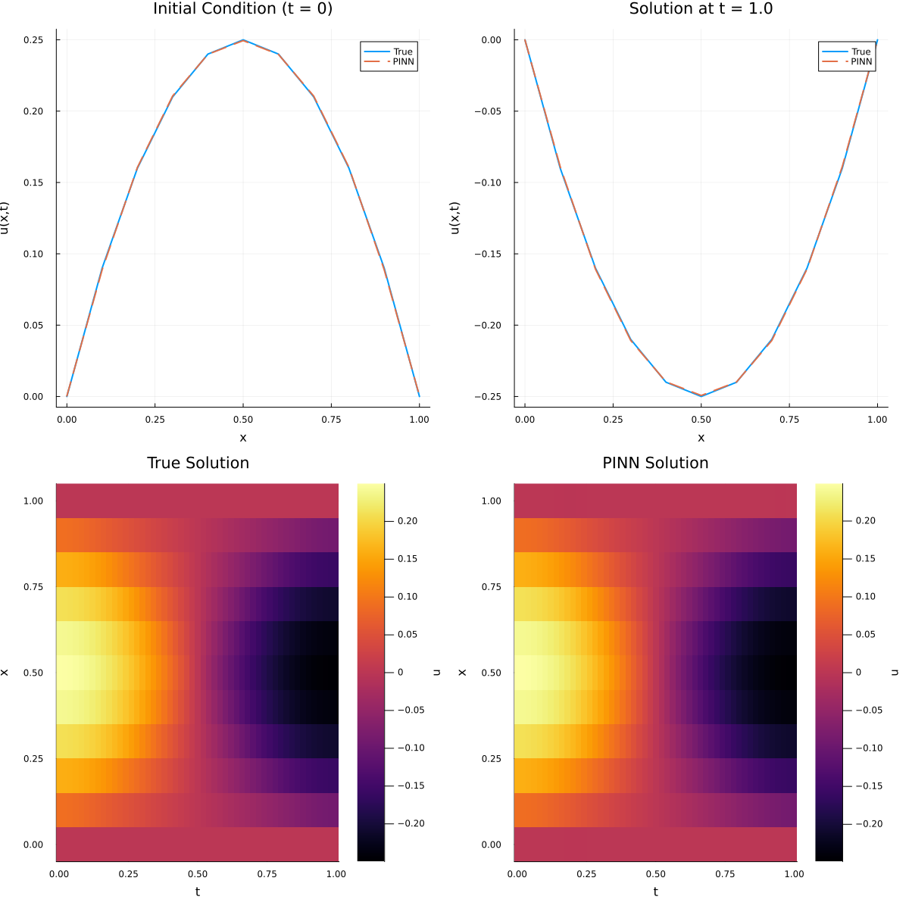

# 1D Wave Equation with Physics-Informed Neural Networks (PINNs)

## 📊 Status Badges

| Badge | Status |
|-------|--------|
| **CI Pipeline** | [](https://github.com/digvijay1992/1d-wave-pinn/actions/workflows/ci.yml) |
| **Julia Version** | [](https://julialang.org/) |
| **License** | [](https://opensource.org/licenses/MIT) |
| **Last Commit** |  |
| **Code Size** |  |
| **Open Issues** |  |

[](https://github.com/digvijay1992/1d-wave-pinn/stargazers)
[](https://github.com/digvijay1992/1d-wave-pinn/network/members)
[](https://github.com/digvijay1992/1d-wave-pinn/watchers)

> A Physics-Informed Neural Network (PINN) solver for the **1D wave equation** using Julia's SciML stack, including analytic reference solution, error metrics, rich visualizations, and GIF animations.

## 📌 Table of Contents
- [1D Wave Equation with Physics-Informed Neural Networks (PINNs)](#1d-wave-equation-with-physics-informed-neural-networks-pinns)
  - [📊 Status Badges](#-status-badges)
  - [📌 Table of Contents](#-table-of-contents)
  - [📖 Overview](#-overview)
  - [🧮 PDE Problem Setup](#-pde-problem-setup)
    - [Wave Equation](#wave-equation)
    - [Boundary and Initial Conditions](#boundary-and-initial-conditions)
    - [Analytical Fourier Series Solution](#analytical-fourier-series-solution)
  - [🧠 PINN Architecture \& Discretization](#-pinn-architecture--discretization)
  - [📊 Error Metrics \& Diagnostics](#-error-metrics--diagnostics)
  - [📈 Visualization](#-visualization)
    - [Example Figures](#example-figures)
  - [🛠️ Installation](#️-installation)
    - [Clone the repository](#clone-the-repository)
    - [Set up the Julia environment](#set-up-the-julia-environment)
  - [🚀 Usage](#-usage)
  - [📊 Parameters](#-parameters)
    - [Physical and Numerical Parameters](#physical-and-numerical-parameters)
    - [PINN \& Training Hyperparameters](#pinn--training-hyperparameters)
  - [📚 Theoretical Background](#-theoretical-background)
  - [📄 License](#-license)
  - [👤 Author](#-author)

## 📖 Overview

This repository implements a **Physics-Informed Neural Network** for the classical **1D wave equation** on a unit spatial domain and finite time interval. The PINN is trained against the governing PDE and boundary/initial conditions, then compared to an **analytical Fourier-series solution** for quantitative error assessment.




The project demonstrates a full workflow for PINNs in Julia:

- Symbolic PDE specification via **ModelingToolkit / NeuralPDE**.
- PINN construction using **Lux** and **ComponentArrays**.
- Training with **Adam → BFGS** using the **Optimization** ecosystem.
- Evaluation, error metrics, static plots, and **GIF animations** for both solution fields and loss history.


## 🧮 PDE Problem Setup

### Wave Equation

We solve the 1D wave equation on \(x \in [0,1]\), \(t \in [0,T]\):

\[
u_{tt}(x,t) = c^2\,u_{xx}(x,t)
\]

with constant wave speed \(c = 1.0\).

### Boundary and Initial Conditions

The model uses homogeneous Dirichlet boundaries and smooth initial data:

- Boundary conditions:
  - \(u(0,t) = 0\)
  - \(u(1,t) = 0\)

- Initial conditions:
  - \(u(x,0) = x(1 - x)\)
  - \(u_t(x,0) = 0\)

The PINN is trained on a grid-based strategy with spatial step \(dx = 0.1\) over the time interval \(t \in [0,1]\).

### Analytical Fourier Series Solution

For the chosen initial displacement \(f(x) = x(1-x)\), the solution admits a Fourier sine series representation:

- Sine-series coefficients:
  - \(a_n = 8 / (\pi^3 n^3)\) for odd \(n\)
  - \(a_n = 0\) for even \(n\)

- Analytical solution:
  \[
  u_{\text{true}}(x,t) = \sum_{n=1}^{N} a_n \cos(c n \pi t)\sin(n \pi x),
  \]
  evaluated up to \(N = 200\) modes for high accuracy.

The script builds a dense space–time grid and computes the analytical solution \(U_{\text{true}}(x_i,t_j)\) for benchmarking.

## 🧠 PINN Architecture & Discretization

The PINN uses a **fully connected neural network** that learns a mapping \((x,t) \mapsto u(x,t)\):

- Network architecture (implemented with **Lux**):

  - Input dimension: 2 (x, t).
  - Hidden layers: 3.
  - Hidden units: 32 per layer.
  - Activation: `tanh` for all hidden layers.
  - Output layer: 1 neuron (scalar displacement \(u\)).

- Initialization and parameter handling:

  - Parameters initialized via `Lux.setup` with a `Random.default_rng()` seed.
  - Parameters wrapped in `ComponentArray` and promoted to `Float64` for AD compatibility.

- PINN discretization:

  - PDE system defined using `@parameters`, `@variables`, and `PDESystem` from **ModelingToolkit / NeuralPDE**.
  - Residual-based training via `PhysicsInformedNN(chain, GridTraining(dx))`.
  - The PDE, BCs, and ICs are enforced by automatic differentiation over the grid.

- Optimization strategy:

  - Phase 1: **Adam** optimizer with learning rate 0.001 for 4000 iterations.
  - Phase 2: **BFGS** refinement for 3000 iterations, initialized from the Adam solution.
  - A custom callback records loss and phase labels (`"Adam"` vs `"BFGS"`) for diagnostics and plotting.

## 📊 Error Metrics & Diagnostics

After training, the script evaluates the PINN on a uniform grid in space and time:

- Evaluation grid:
  - Spatial grid: `x_vals = 0.0:dx:1.0`.
  - Temporal grid: `t_vals = 0.0:dt:Tfinal` with `dt = 0.02`.

- PINN prediction:
  - A helper `u_pinn(x,t,θ)` evaluates the trained network via `discretization.phi`.
  - `U_pinn` collects predictions on the grid, aligned with `U_true`.

- Error field:
  - Absolute error: `Err = abs.(U_pinn .- U_true)`.

- Global metrics:
  - Mean absolute error (MAE).
  - Root-mean-square error (RMSE).
  - Maximum absolute error over the grid.

The script also prints **snapshot errors** at selected times \(t = 0.0, 0.25, 0.5, 0.75, 1.0\), reporting MAE and max error for each time slice.

## 📈 Visualization

The project produces high-quality static plots and GIF animations for qualitative assessment:

- Static plots:
  - Initial condition comparison at \(t = 0\): true vs PINN line plot (saved as `initial_condition_comparison.png`).
  - Final-time profile at \(t = 1.0\): true vs PINN line plot (saved as `finaltime_comparison.png`).
  - Heatmaps:
    - `true_solution_heatmap.png` for \(U_{\text{true}}(x,t)\).
    - `pinn_solution_heatmap.png` for \(U_{\text{pinn}}(x,t)\).
  - Composite figure `wave_pinn_comparison.png` combining line plots and both heatmaps.

- GIFs:
  - `pinn_vs_true.gif`: line plot animation of true vs PINN solution over time.
  - `loss_history.gif`: log-scale loss history, with a vertical dashed line marking the transition from Adam to BFGS.
  - `heatmap_pinn_vs_true.gif`: animated heatmaps of true and PINN solutions up to the current time, stacked vertically.

These assets make the repository useful both as a **benchmark** and as a **didactic example** for PINNs.

### Example Figures




## 🛠️ Installation

### Clone the repository

```bash
git clone https://github.com/digvijay1992/1d-wave-pinn.git
cd 1d-wave-pinn
```

### Set up the Julia environment

From the repository root, open Julia and activate/instantiate the project:

```julia
using Pkg
Pkg.activate(".")
Pkg.instantiate()
```

If needed, you can explicitly add dependencies (already listed in `Project.toml`):

```julia
Pkg.add([
    "NeuralPDE",
    "Lux",
    "ModelingToolkit",
    "Optimization",
    "OptimizationOptimisers",
    "OptimizationOptimJL",
    "Random",
    "ComponentArrays",
    "Plots",
    "JLD2",
    "CSV",
    "Tables",
    "DomainSets",
    "Statistics",
    "StatsBase"
])
```

## 🚀 Usage

Run the main script from the repository root:

```bash
julia 1d_wave_pinn.jl
```

This will:

- Define the PDE, boundary, and initial conditions symbolically.
- Construct and initialize the Lux PINN model.
- Train the PINN with Adam followed by BFGS, logging phase-specific loss history.
- Evaluate the analytical and PINN solutions on a space–time grid.
- Compute error metrics and snapshot diagnostics.
- Generate static plots and GIFs in the working directory.
- Save simulation data as:
  - `wave_pinn_simulation.jld2` (JLD2 file) for structured reuse.
  - `wave_pinn_simulation.csv` for external tools (Python, MATLAB, etc.).

## 📊 Parameters

### Physical and Numerical Parameters

| Parameter | Symbol | Default | Description |
|----------|--------|---------|-------------|
| Wave speed | \(c\) | 1.0 | Constant propagation speed. |
| Final time | \(T_{\text{final}}\) | 1.0 | End of simulation interval. |
| Spatial step | `dx` | 0.1 | Grid spacing used for training and evaluation. |
| Time step | `dt` | 0.02 | Time spacing for evaluation grid. |
| Fourier modes | `Nfourier` | 200 | Number of modes in analytic series. |
| Random seed | `seed` | 1234 | Ensures reproducible network initialization. |

### PINN & Training Hyperparameters

| Component | Value | Description |
|----------|-------|-------------|
| Hidden layers | 3 | Depth of fully connected Lux network. |
| Hidden units | 32 | Neurons per hidden layer. |
| Activation | `tanh` | Nonlinearities for all hidden layers. |
| Output | 1 | Scalar displacement \(u(x,t)\). |
| Training strategy | `GridTraining(dx)` | Grid-based PINN residual sampling.|
| Optimizer (phase 1) | Adam | Learning rate 0.001, 4000 iterations. |
| Optimizer (phase 2) | BFGS | 3000 iterations, initialized from Adam solution. |

## 📚 Theoretical Background

Physics-Informed Neural Networks embed the **governing equations and boundary/initial conditions** directly into the loss function, enabling **data-efficient learning** of solution fields:

- The PDE residual \(u_{tt} - c^2 u_{xx}\) is enforced via automatic differentiation on the network output \(u(x,t)\).
- Boundary and initial conditions are included as penalty terms at sampled points in space–time.
- By benchmarking against an exact Fourier-series solution, this example illustrates how PINNs can approximate **smooth, oscillatory wave dynamics** on relatively coarse grids with modest network sizes.

This repository therefore serves as a compact reference for:

- PINN formulation for hyperbolic PDEs.
- Combining **NeuralPDE**, **Lux**, and **Optimization** in Julia.
- Designing reproducible experiments with analytic baselines and rich visual diagnostics.

## 📄 License

This project is licensed under the **MIT License**. See the `LICENSE` file for details.

## 👤 Author

**Digvijay Singh**

- GitHub: [@digvijay1992](https://github.com/digvijay1992)
- Specialization: CFD, multiphase flow, scientific machine learning, PINNs, and Julia-based surrogate modeling.
